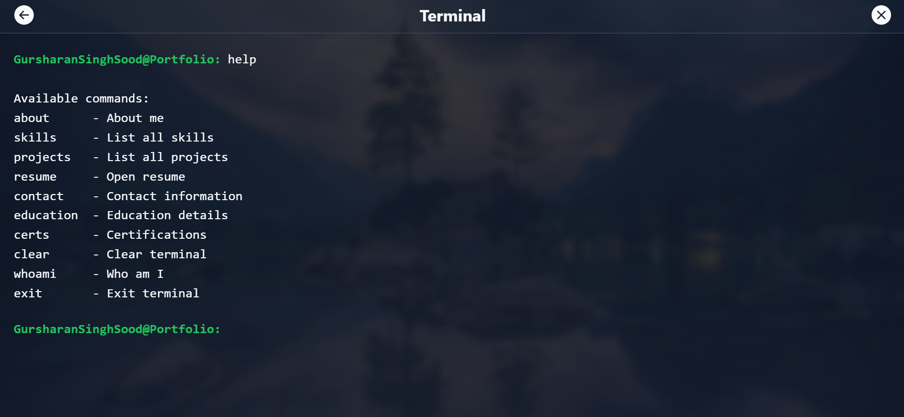

# Personal Portfolio — MERN + Vite Frontend

Professional, responsive personal portfolio built with React (Vite) frontend and a lightweight Node/Express backend for contact/email. The frontend demonstrates an animated desktop-like UI, project gallery, contact form, terminal widget and project pages. The backend exposes a single email endpoint used by the contact form.

---

## Table of Contents

- Project overview
- Key features
- Tech stack
- Repository structure
- Prerequisites (Windows)
- Setup (development)
  - Backend
  - Frontend
- Environment variables
- Build & deploy
- Screenshots (10 images from `assets/`)
- Notes & customizing images
- Contribution
- License

---

## Project overview

This repository hosts a professional portfolio showcasing projects, skills and contact functionality. The UI is built using React + Tailwind (Vite) with motion effects. A minimal Express server handles sending contact emails.

---

## Key features

- Clean, accessible, animated UI
- Project gallery and detail pages
- Contact form (email sending via backend)
- Terminal-style mini CLI
- Theme switching (dark / light)
- Responsive layout and image gallery

---

## Tech stack

- Frontend: React, Vite, Tailwind CSS, Framer Motion
- Backend: Node.js, Express
- Dev tools: npm, ESLint, Vite

---

## Repository structure

- client/ — React + Vite frontend
  - src/ — React source, components, pages, assets
- server/ — Node/Express backend for contact email
  - src/ — server app, controllers, services, config
- assets/ — place portfolio screenshots / images (project root)
- README.md — this file

---

## Prerequisites (Windows)

- Node.js (v16+)
- npm (v8+)
- Optional: an SMTP provider (Gmail, SendGrid) or a test SMTP server for email

---

## Setup — Development

Open PowerShell / CMD in project root (d:\Coding\Git Repository\Portfolio)

1. Backend
   - cd server
   - npm install
   - Create/modify `.env` in `server/` (see Environment variables)
   - Start server:
     - npm start
   - By default the server listens on the port configured in `server/config/config.js` or 5000 (confirm in code).

2. Frontend
   - Open a new terminal
   - cd client
   - npm install
   - Start dev server:
     - npm run dev
   - Vite default dev URL shown in terminal (commonly http://localhost:5173).

---

## Environment variables

server/.env (example)

- EMAIL_SERVICE=Gmail
- EMAIL_USER=youremail@example.com
- EMAIL_PASS=your-email-password-or-app-password
- PORT=5000
  Adjust `server/src/config/email.config.js` if using a different provider.

client/.env (example — optional)

- VITE_API_BASE_URL=http://localhost:5000/api

Make sure to never commit real credentials to source control.

---

## Build & Deployment

1. Build frontend:
   - cd client
   - npm run build
   - The static assets will be in `client/dist`.

2. Serve built frontend:
   - Use a static host (Netlify, Vercel, GitHub Pages) OR serve via the Express server (optional — copy files into server static folder and enable static serving).

3. Backend production:
   - Ensure environment variables are set in your host.
   - Use a process manager (pm2) or a platform (Heroku, Render, Railway) to start `server/server.js` or `npm start`.

---

## Screenshots (place 10 images inside `assets/` at project root)

Place your images in `d:\Coding\Git Repository\Portfolio\assets\` and update names if necessary. Example references (already included below; rename your files to match or change paths):

1. 
2. 
3. 
4. 
5. 
6. 
7. 
8. 
9. 
10. 

Notes:

- Use JPG/PNG. For transparency prefer PNG.
- If your filenames differ (e.g., `home.png`, `project-1.jpg`), update the Markdown links above or rename files into the `assets/` folder.
- When publishing to GitHub, large images can be hosted elsewhere (Cloudinary, S3) and referenced via absolute URLs to reduce repo size.

---

## Customizing images in the repo

- Add images to `assets/` folder.
- Example Markdown to add more screenshots:
  - ``
- If the frontend references assets directly (client/src/assets/...), copy or symlink images to that directory or update frontend code to read from `/assets/...` hosted path.

---

## Notes

- Double-check `server/src/config/email.config.js` and `server/src/config/config.js` for production adjustments (ports, CORS, allowed origins).
- If email fails with Gmail, enable app passwords or use a transactional email provider.

---

## Contribute

- Fork the repo, create a feature branch, open a pull request with clear description.
- For issues, open an issue with reproduction steps and screenshots if relevant.

---

## License

Specify your preferred license (e.g., MIT). Add a LICENSE file if required.

---

If you want, I can:

- Add working example `.env` templates to `client/` and `server/`
- Rename or list actual filenames from your `assets/` folder and update image links accordingly
