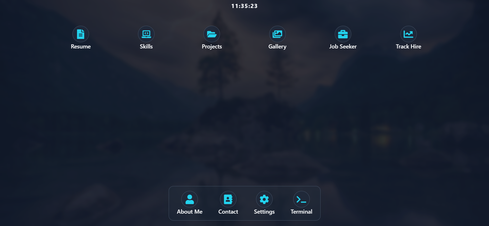
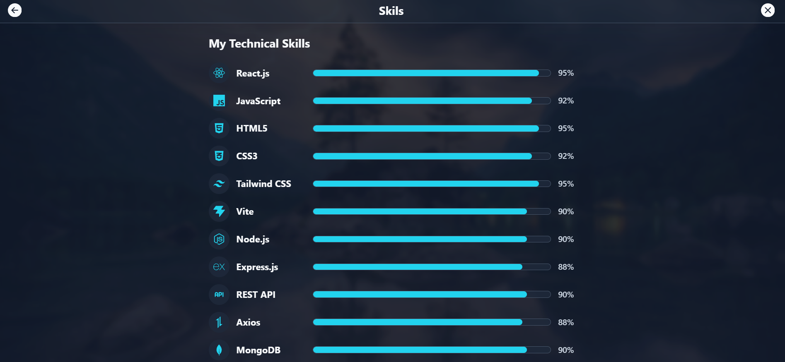
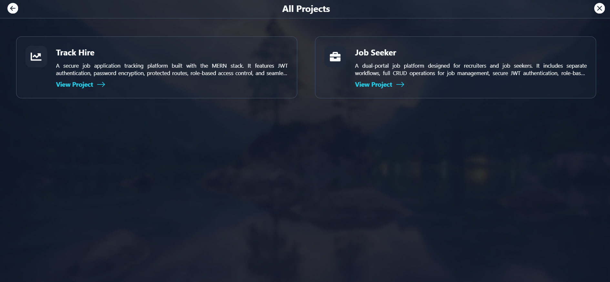
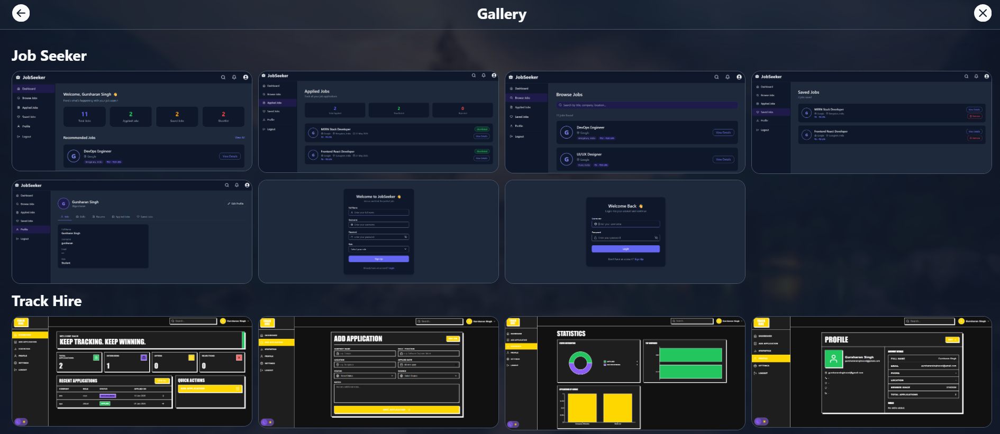
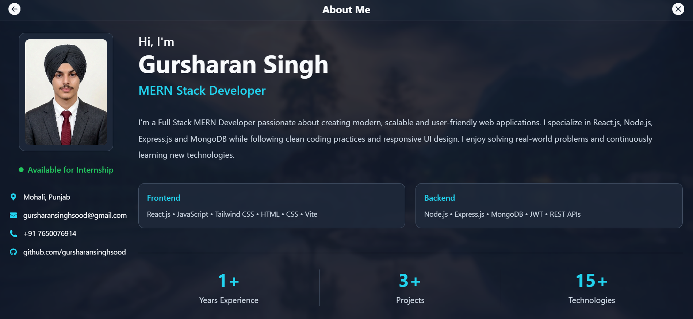
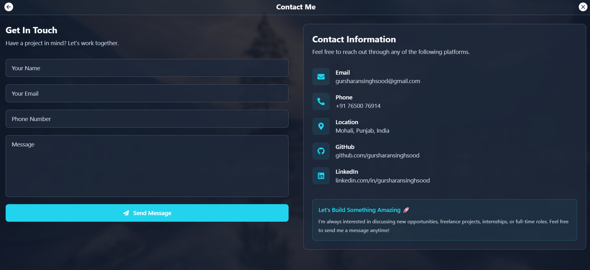
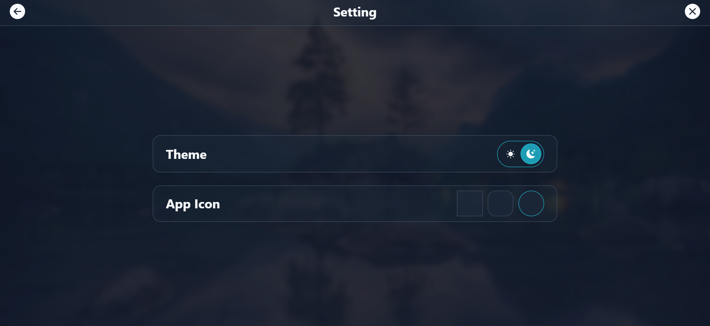

# 🚀 Personal Portfolio

A modern, responsive, and interactive personal portfolio built with **React (Vite)** for the frontend and **Node.js + Express** for the backend. The application features a desktop-inspired interface, smooth animations, project showcase, terminal widget, and a fully functional contact form powered by an Express API.

---

## ✨ Features

- 🎨 Modern desktop-inspired UI
- 🌙 Light & Dark Theme
- 📱 Fully Responsive Design
- ⚡ Smooth Page Transitions
- 💻 Interactive Terminal Widget
- 📂 Project Showcase
- 📧 Contact Form with Email Integration
- 🚀 Fast Performance with Vite
- 🧩 Reusable React Components

---

# 🛠 Tech Stack

### Frontend

- React
- Vite
- Tailwind CSS
- Framer Motion
- React Router
- React Icons

### Backend

- Node.js
- Express.js
- Nodemailer

### Tools

- Git
- GitHub
- npm
- ESLint

---

# 📁 Project Structure

```text
Portfolio
│
├── client
│   ├── src
│   │   ├── assets
│   │   ├── components
│   │   ├── context
│   │   ├── pages
│   │   ├── services
│   │   └── App.jsx
│   └── package.json
│
├── server
│   ├── src
│   ├── server.js
│   ├── package.json
│   └── .env
│
├── assets
├── README.md
└── .gitignore
```

---

# ⚙️ Getting Started

## Prerequisites

- Node.js 18+
- npm

---

## Clone Repository

```bash
git clone https://github.com/gursharansinghsood/Portfolio.git

cd Portfolio
```

---

# Backend Setup

```bash
cd server

npm install
```

Create `.env`

```env
PORT=5000

EMAIL_SERVICE=Gmail
EMAIL_USER=your-email@gmail.com
EMAIL_PASS=your-app-password
```

Run Server

```bash
npm start
```

---

# Frontend Setup

Open another terminal

```bash
cd client

npm install

npm run dev
```

Visit

```text
http://localhost:5173
```

---

# 🌐 Environment Variables

## server/.env

```env
PORT=5000

EMAIL_SERVICE=Gmail
EMAIL_USER=your-email@gmail.com
EMAIL_PASS=your-app-password
```

## client/.env

```env
VITE_API_BASE_URL=http://localhost:5000/api
```

> Never commit your `.env` file.

---

# 🚀 Build

```bash
cd client

npm run build
```

Production build

```text
client/dist
```

---

# 📸 Screenshots

## 🔐 Lock Screen


---

## 🏠 Home



---

## 💻 Skills



---

## 📂 Projects



---

## 🖼 Gallery



---

## 👤 About



---

## 📧 Contact



---

## ⚙️ Settings



---

## 💻 Terminal


---

# 🤝 Contributing

Contributions are welcome.

1. Fork this repository
2. Create your feature branch

```bash
git checkout -b feature-name
```

3. Commit your changes

```bash
git commit -m "Add new feature"
```

4. Push

```bash
git push origin feature-name
```

5. Create a Pull Request

---

# 📄 License

This project is licensed under the **MIT License**.

---

# ⭐ Support

If you like this project, don't forget to leave a ⭐ on GitHub.

Made with ❤️ by **Gursharan Singh**
